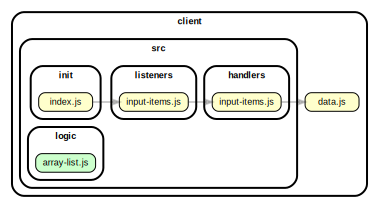

<!-- BEGIN TITLE -->

# DOCS

<!-- END TITLE -->

<!-- BEGIN TREE -->

> [interactive graph](./dependency-graph.html)



<!-- END TREE -->

<!-- BEGIN TOC -->

- public
- src
  - components
    - [render-table.js](#clientsrccomponentsrender-tablejs)
  - handlers
    - [edit-description.js](#clientsrchandlersedit-descriptionjs)
    - [input-items.js](#clientsrchandlersinput-itemsjs)
    - [new-description.js](#clientsrchandlersnew-descriptionjs)
    - [remove-item.js](#clientsrchandlersremove-itemjs)
  - init
    - [index.js](#clientsrcinitindexjs)
  - listeners
    - [edit-description.js](#clientsrclistenersedit-descriptionjs)
    - [input-items.js](#clientsrclistenersinput-itemsjs)
    - [remove-list.js](#clientsrclistenersremove-listjs)
  - logic
    - [array-list.js](#clientsrclogicarray-listjs)
- styles
- [data.js](#clientdatajs)

---

<!-- END TOC -->

<!-- BEGIN DOCS -->

# /public

---

# /src

## /components

<details><summary><a href="../../client/src/components/render-table.js" id="clientsrccomponentsrender-tablejs">../client/src/components/render-table.js</a></summary>

<a name="renderTable"></a>

## renderTable ⇒ <code>string</code>

A function that renders a table element from user inputted item title and description string arrays.

**Returns**: <code>string</code> - Will return a table of list items and descriptions in a string.

| Param               | Type               | Description                                                    |
| ------------------- | ------------------ | -------------------------------------------------------------- |
| itemToRender        | <code>Array</code> | The string array to render into item title table data element. |
| descriptionToRender | <code>Array</code> | The string array to render into item description data element. |

**Example**

```js
// ["item title 1", "item title 2"], ["item description 1", "item description 2"]
  --> "<table id="display-table">
        <tr id="item-row-1">
         <td id=item-td-1">item title 1</td>
         
         
        </tr>
        <tr id="description-row-1">
         <td id="description-td-1">item description 1</td>
        </tr>
        <tr id="item-row-2">
         <td id=item-td-2">item title 2</td>
         
         
        </tr>
        <tr id="description-row-2">
         <td id="description-td-2">item description 2</td>
        </tr>
       </table>"
```

</details>

---

## /handlers

<details><summary><a href="../../client/src/handlers/edit-description.js" id="clientsrchandlersedit-descriptionjs">../client/src/handlers/edit-description.js</a></summary>

<a name="editDescription"></a>

## editDescription

Entry point: user interaction. To edit a list item description.
It is called each time the user clicks the "edit" icon.

| Param | Type               | Description                                               |
| ----- | ------------------ | --------------------------------------------------------- |
| event | <code>Event</code> | The event triggered when the user clicks the "edit" icon. |

</details>

<details><summary><a href="../../client/src/handlers/input-items.js" id="clientsrchandlersinput-itemsjs">../client/src/handlers/input-items.js</a></summary>

## Constants

<dl>
<dt><a href="#getInputHandler">getInputHandler</a></dt>
<dd><p>Entry point for users adding title and description to the list.
It is called each time the user clicks the &quot;add&quot; button.</p>
</dd>
<dt><a href="#getInputWithEnterHandler">getInputWithEnterHandler</a></dt>
<dd><p>Entry point for users adding title and description to the list.
It is called each time the user press the &quot;Enter&quot; key.</p>
</dd>
</dl>

<a name="getInputHandler"></a>

## getInputHandler

Entry point for users adding title and description to the list.
It is called each time the user clicks the "add" button.

| Param | Type               | Description                                          |
| ----- | ------------------ | ---------------------------------------------------- |
| event | <code>Event</code> | The event triggered when the user clicks the button. |

<a name="getInputWithEnterHandler"></a>

## getInputWithEnterHandler

Entry point for users adding title and description to the list.
It is called each time the user press the "Enter" key.

| Param | Type               | Description                                     |
| ----- | ------------------ | ----------------------------------------------- |
| event | <code>Event</code> | The event triggered when press the "Enter" key. |

</details>

<details><summary><a href="../../client/src/handlers/new-description.js" id="clientsrchandlersnew-descriptionjs">../client/src/handlers/new-description.js</a></summary>

<a name="newDescription"></a>

## newDescription

Entry point: user interaction. To edit a list item description.
It is called each time the user clicks the "edit" icon.

| Param | Type               | Description                                               |
| ----- | ------------------ | --------------------------------------------------------- |
| event | <code>Event</code> | The event triggered when the user clicks the "edit" icon. |

</details>

<details><summary><a href="../../client/src/handlers/remove-item.js" id="clientsrchandlersremove-itemjs">../client/src/handlers/remove-item.js</a></summary>

<a name="removeListHandler"></a>

## removeListHandler

Entry point: user interaction. To remove a specific list.
It is called each time the user clicks the "delete"icon.

| Param | Type               | Description                                                 |
| ----- | ------------------ | ----------------------------------------------------------- |
| event | <code>Event</code> | The event triggered when the user clicks the "delete" icon. |

</details>

---

## /init

<details><summary><a href="../../client/src/init/index.js" id="clientsrcinitindexjs">../client/src/init/index.js</a></summary>

</details>

---

## /listeners

<details><summary><a href="../../client/src/listeners/edit-description.js" id="clientsrclistenersedit-descriptionjs">../client/src/listeners/edit-description.js</a></summary>

</details>

<details><summary><a href="../../client/src/listeners/input-items.js" id="clientsrclistenersinput-itemsjs">../client/src/listeners/input-items.js</a></summary>

</details>

<details><summary><a href="../../client/src/listeners/remove-list.js" id="clientsrclistenersremove-listjs">../client/src/listeners/remove-list.js</a></summary>

</details>

---

## /logic

<details><summary><a href="../../client/src/logic/array-list.js" id="clientsrclogicarray-listjs">../client/src/logic/array-list.js</a></summary>

<a name="arrayOfListItems"></a>

## arrayOfListItems ⇒ <code>Array</code>

Convert user input list items to an array of list items.

**Returns**: <code>Array</code> - - An array of list.

| Param       | Type                | Default                                 | Description                                    |
| ----------- | ------------------- | --------------------------------------- | ---------------------------------------------- |
| [listItems] | <code>string</code> | <code>&quot;\&quot;\&quot;&quot;</code> | A string of list that user are going to input. |

</details>

---

---

# /styles

---

<details><summary><a href="../../client/data.js" id="clientdatajs">../client/data.js</a></summary>

</details>

<!-- END DOCS -->
