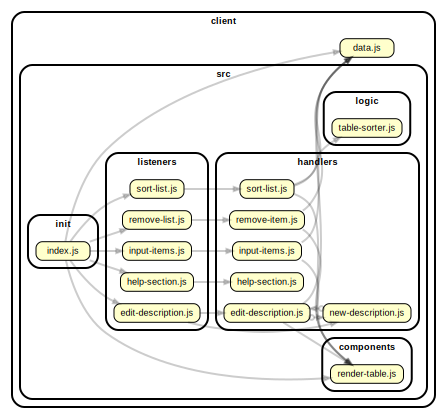

<!-- BEGIN TITLE -->

# DOCS

<!-- END TITLE -->

<!-- BEGIN TREE -->

> [interactive graph](./dependency-graph.html)

<!-- END TREE -->

<!-- BEGIN TOC -->

- public
- src
  - components
  - handlers
    - [input-items.js](#clientsrchandlersinput-itemsjs)
  - init
    - [index.js](#clientsrcinitindexjs)
  - listeners
    - [input-items.js](#clientsrclistenersinput-itemsjs)
  - logic
    - [array-list.js](#clientsrclogicarray-listjs)
- styles
- [data.js](#clientdatajs)

---

<!-- END TOC -->

<!-- BEGIN DOCS -->

# /public

---

# /src

## /components

---

## /handlers

<a href="../../client/src/handlers/input-items.js" id="clientsrchandlersinput-itemsjs">../client/src/handlers/input-items.js</a>

## getInputHandler

Entry point for users adding title and item to the list.
It is called each time the user clicks the "add" button.

| Param | Type               | Description                                          |
| ----- | ------------------ | ---------------------------------------------------- |
| event | <code>Event</code> | The event triggered when the user clicks the button. |

---

## /init

<a href="../../client/src/init/index.js" id="clientsrcinitindexjs">../client/src/init/index.js</a>

---

## /listeners

<a href="../../client/src/listeners/input-items.js" id="clientsrclistenersinput-itemsjs">../client/src/listeners/input-items.js</a>

---

## /logic

<a href="../../client/src/logic/array-list.js" id="clientsrclogicarray-listjs">../client/src/logic/array-list.js</a>

## arrayOfListItems ⇒ <code>Array</code>

Convert user input list items to an array of list items.

**Returns**: <code>Array</code> - - An array of list.

| Param       | Type                | Default                                 | Description                                    |
| ----------- | ------------------- | --------------------------------------- | ---------------------------------------------- |
| [listItems] | <code>string</code> | <code>&quot;\&quot;\&quot;&quot;</code> | A string of list that user are going to input. |

---

---

# /styles

---

<a href="../../client/data.js" id="clientdatajs">../client/data.js</a>

<!-- END DOCS -->
